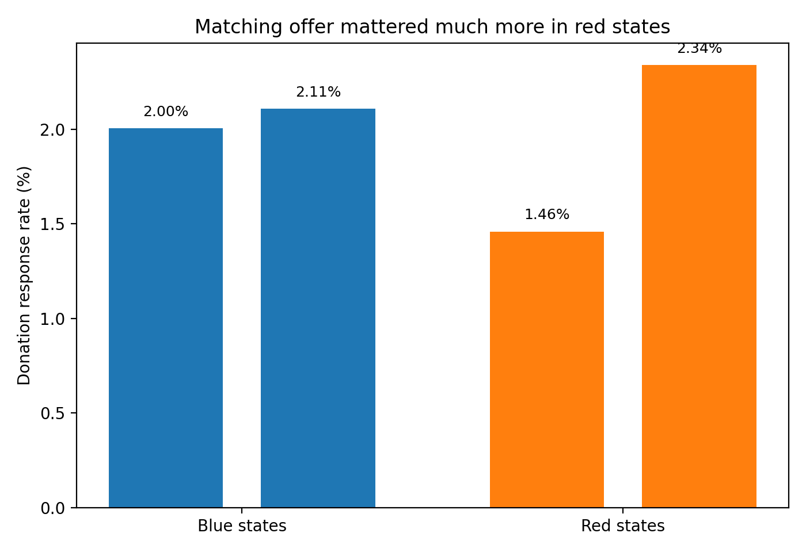

## Introduction

Karlan and List (2007) study whether reducing the effective "price" of giving through a matching grant changes charitable behavior. The setting is a large natural field experiment run through a real direct-mail fundraising campaign. More than 50,000 prior donors to a US nonprofit were randomly assigned either to a control letter or to a treatment letter that announced a matching grant. Within the treatment group, the authors also randomized the match ratio ($1:$1, $2:$1, or $3:$1), the maximum size of the matching pool, and the suggested example amount.

This paper is a clean fit for a causal inference assignment because the key treatment—receiving a matching offer—was randomly assigned. That design breaks the link between donor characteristics and treatment status, so a difference in means can be interpreted causally rather than as selection bias. In the language from class, random assignment makes treatment independent of potential outcomes, which is exactly why an experiment solves the selection-bias problem.

The paper's main findings are intuitive but not identical to conventional fundraising wisdom. A matching offer increases response rates and revenue per solicitation, but larger match ratios do **not** outperform a simple 1:1 match. In other words, having a match matters; making the match more generous does not seem to matter much.

## Main Analysis

### Data and replication target

For this assignment I use the provided files `AERtables1-5.dta`, `AERtables1-5.do`, and `karlan_list_2007.pdf`. I focus on the Karlan & List option and replicate the parts the instructor asked for:

1. some of Table 1, to check balance between treatment and control;
2. Table 2A Panel A, the core summary-statistics results; and
3. one column of Table 3, plus a short diagnostic showing why a linear probability model matches the published coefficients especially closely.

I keep the sample used in the paper: observations with either `treatment == 1` or `control == 1`, which gives 50,083 donors.

### Replicating Table 1: balance between treatment and control

A key implication of random assignment is that the treatment and control groups should look similar before treatment. The supplied Stata do-file checks balance using the variables below, so I replicate that subset of Table 1.

| Variable                      |   Treatment mean |   Control mean |   Mean diff (T-C) |   p-value |
|:------------------------------|-----------------:|---------------:|------------------:|----------:|
| Months since last donation    |           13.012 |         12.998 |             0.014 |     0.905 |
| Highest previous contribution |           59.597 |         58.96  |             0.637 |     0.332 |
| Number of prior donations     |            8.035 |          8.047 |            -0.012 |     0.912 |
| Years since initial donation  |            6.078 |          6.136 |            -0.058 |     0.275 |
| Already donated in 2005       |            0.524 |          0.523 |             0.001 |     0.862 |
| Female                        |            0.275 |          0.283 |            -0.008 |     0.08  |
| Couple                        |            0.091 |          0.093 |            -0.002 |     0.56  |
| Red state                     |            0.407 |          0.399 |             0.009 |     0.06  |
| Red county                    |            0.512 |          0.507 |             0.004 |     0.366 |
| Nonlitigation                 |            2.485 |          2.453 |             0.032 |     0.088 |
| Cases                         |            1.499 |          1.502 |            -0.004 |     0.733 |

The balance table looks very good. Almost all mean differences are tiny in magnitude and statistically insignificant. A few p-values are near 0.10, but the overall pattern is exactly what we want from a randomized design: treatment and control look very similar before the mailer was sent. That is strong evidence against selection bias in the experimental assignment.

### Replicating Table 2A Panel A

Next I replicate the main descriptive results in Table 2A Panel A.

| Group      |     N |   Response rate |   Dollars given, unconditional |   Dollars given, conditional on giving |   Dollars raised per letter, not including match |
|:-----------|------:|----------------:|-------------------------------:|---------------------------------------:|-------------------------------------------------:|
| Control    | 16687 |           0.018 |                          0.813 |                                 45.54  |                                            0.813 |
| Treatment  | 33396 |           0.022 |                          0.967 |                                 43.872 |                                            0.967 |
| 1:1        | 11133 |           0.021 |                          0.937 |                                 45.143 |                                            0.937 |
| 2:1        | 11134 |           0.023 |                          1.026 |                                 45.337 |                                            1.026 |
| 3:1        | 11129 |           0.023 |                          0.938 |                                 41.252 |                                            0.938 |
| $25,000    |  8350 |           0.022 |                          1.06  |                                 49.172 |                                            1.06  |
| $50,000    |  8345 |           0.022 |                          0.889 |                                 39.674 |                                            0.889 |
| $100,000   |  8350 |           0.022 |                          0.903 |                                 41     |                                            0.903 |
| Unstated   |  8351 |           0.022 |                          1.015 |                                 45.815 |                                            1.015 |
| Low ask    | 11134 |           0.021 |                          0.914 |                                 43.107 |                                            0.914 |
| Medium ask | 11133 |           0.022 |                          1.004 |                                 45.239 |                                            1.004 |
| High ask   | 11129 |           0.023 |                          0.983 |                                 43.251 |                                            0.983 |

These numbers line up very closely with the published table. The core takeaway is the same as in the paper:

- The treatment raises the response rate from about **1.8%** to **2.2%**.
- It raises unconditional dollars per letter from about **$0.81** to **$0.97**.
- But once donors decide to give, conditional gift size changes little; the main action is on the **extensive margin** (whether someone gives at all), not the amount conditional on giving.
- The three match ratios are very similar to one another, which supports the paper's conclusion that moving from 1:1 to 2:1 or 3:1 adds little.

### Replicating Table 3

The assignment note warns that Table 3 in the article is labeled as a probit table, but the printed coefficients look much more like a **linear probability model (LPM)** than probit marginal effects. I therefore estimate both and compare them.

For column (1), the paper reports a treatment coefficient of **0.004**. My LPM estimate is **0.00418**, while the probit marginal effect is **0.00431**. Both are close, but the LPM is even closer to the published coefficient. The same pattern holds in the other simple-treatment columns.

Here is a direct comparison for the main treatment coefficient in several Table 3 specifications:

| Statistic          |   Paper |   Our LPM |   Absolute difference |
|:-------------------|--------:|----------:|----------------------:|
| All_col1           |   0.004 |    0.0042 |                0.0002 |
| All_col2_treatment |   0.002 |    0.0022 |                0.0002 |
| Already_col3       |   0.003 |    0.0031 |                0.0001 |
| Notyet_col5        |   0.005 |    0.0054 |                0.0004 |

This is why I would report the Table 3 replication using the LPM values. The treatment effects are essentially the same as the article:

- Full sample, simple treatment regression: about **0.004**
- Full sample, expanded controls for match features: about **0.002**
- Donors who already gave in 2005: about **0.003**
- Donors who had not yet given in 2005: about **0.005**

Substantively, that means the match offer modestly raises the probability of donating, and the effect appears somewhat stronger among people who had not yet donated that year.

## Something Additional

For the additional piece, I turn one of the paper's table-based heterogeneity results into a graph. The paper shows that the treatment effect is much stronger in red states than in blue states. Instead of leaving that result only in a table, I plot the response rates directly.

The graph makes the pattern easy to see:

- In **blue states**, the response rate barely moves: from about **2.00%** in control to **2.11%** in treatment.
- In **red states**, the response rate jumps much more: from about **1.46%** in control to **2.34%** in treatment.

I also estimate a simple interaction model:

`gave = alpha + beta1*treatment + beta2*red_state + beta3*(treatment x red_state) + error`

The LPM interaction results are:

| Variable        |   LPM coef |   LPM se |   LPM p |
|:----------------|-----------:|---------:|--------:|
| const           |     0.02   |   0.0014 |  0      |
| treatment       |     0.001  |   0.0017 |  0.5494 |
| red0            |    -0.0055 |   0.0022 |  0.0153 |
| treatment_x_red |     0.0078 |   0.0028 |  0.0048 |

The interaction term is positive and statistically significant. In plain English, the matching offer worked much better in red states. This does not change the paper's main causal result, because treatment is still randomized, but it does show that treatment effects are heterogeneous across environments.

## Conclusion

This replication successfully reproduces the main message of Karlan and List (2007).

First, the experiment appears genuinely randomized: treatment and control are balanced on observed characteristics. Second, the central result from Table 2A replicates cleanly: announcing a matching grant increases the probability of donating and raises dollars per solicitation. Third, Table 3 is replicated especially closely with a linear probability model, which is consistent with the instructor's warning that the printed coefficients look more like OLS/LPM than probit marginal effects.

My additional graph also highlights one of the most interesting findings in the paper: the matching offer was much more effective in red states than in blue states. That extension helps show that even in a randomized experiment, average treatment effects can hide important heterogeneity.

## Files used

- `karlan_list_2007.pdf`
- `AERtables1-5.dta`
- `AERtables1-5.do`
- `AERtable6census.dta`
- `README_data_update.pdf`

## Reproducibility note

I wrote a Python replication script that reads the provided `.dta` files, recreates the balance checks, computes the Table 2A Panel A summaries, compares LPM and probit versions of Table 3, and saves the additional figure. The script is included separately as `replicate_karlan_list.py`.
